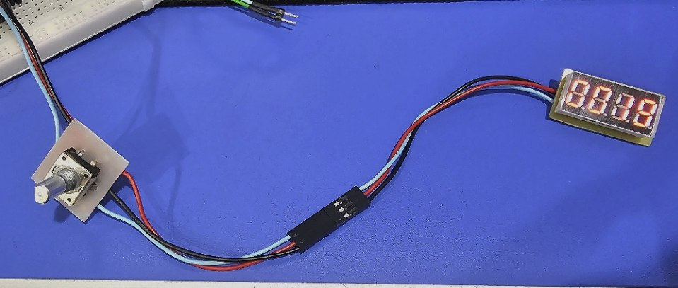
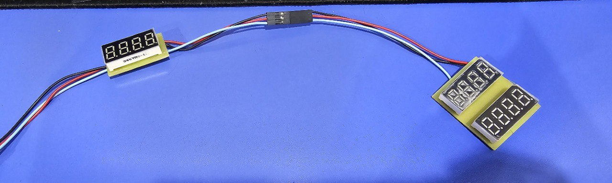
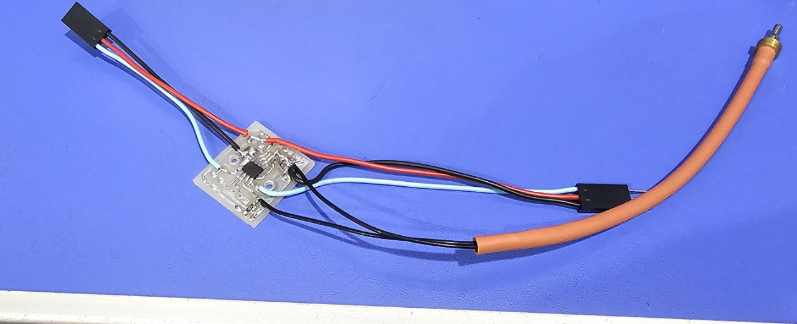

## Drivers
Currently, Drivers works with direct-drive method instead of master daisy communication protocol. It will be completed in later.

### Setup
Firstly, clone [ch32v003fun](https://github.com/cnlohr/ch32v003fun) project then put drivers into examples folder. Run ``` make clean flash ``` command in the folder.

### Demos
I made some boards based on J4M6 and A4M6 package chips. 

> Rotary encoder and display combo


> Chained displays


> NTC Thermistor Demo
